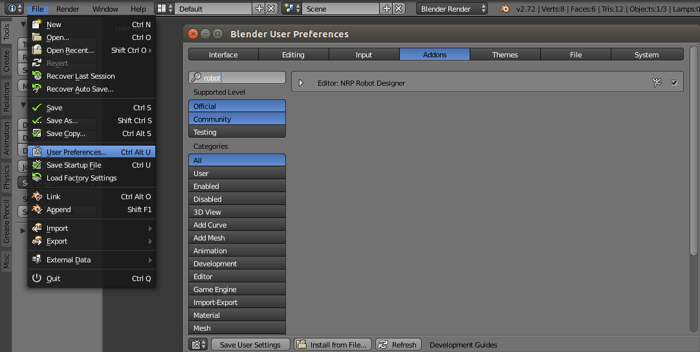

.. _installation:

Installation
============

Get a copy
----------

The NRP RobotDesigner is currently hosted at the EPFL server and will be migrated to an open repository in the
near future. To obtain a copy you need to have the distributed version control system `git <https://git-scm.com/>`_
installed on your system. On Mac/Linux, run the following command:

.. code-block:: shell

    git clone ssh://${USER}@bbpcode.epfl.ch/neurorobotics/RobotDesigner

Installation
------------

The RobotDesigner is a plugin for the `Blender 3D modelling suite <http://blender.org>`_ written in Python.
It depends on some modules that **are not** shipped with blender:

* gitpython
* lxml

Unfortunately these python modules depend on the following binaries:

* `git <https://git-scm.com>`_
* libxml2-dev
* libxslt1-dev
* lib32z1-dev

Linux & Mac OS X
^^^^^^^^^^^^^^^^

A script is provided to ease the installation of the plugin.
This script relies on pip and virtualenv that you have to install manually for python3.
You can refer to their installation guides:

* `pip <https://pip.pypa.io/en/latest/installing.html>`_
* `virtualenv <https://virtualenv.pypa.io/en/latest/installation.html>`_

For debian-based linux distribution, you can run:

.. code-block:: shell

   sudo apt-get install python3-pip
   pip3 install virtualenv

.. warning::
   So far, the script does not handle the installation of git which also has to be done manually.
   Please refer to `git installation guide <https://git-scm.com/downloads>`_.

#. Create a python3 virtualenv named **py3env** at the root of this module

.. code-block:: shell

   virtualenv -p
   /usr/bin/python3 {path-to-RobotDesigner}/py3env

#. Open the file :download:`installer.blend <../../installer.blend>` with Blender
#. Click the button **Run script** in Blender text editor (shortcut Alt + p)
#. If nothing happened, everything worked fine; otherwise refer to troubleshooting_.
#. Restart Blender

.. note::
   If you move this addon to a different folder in your filesystem you have to run this installation script again.

Windows
^^^^^^^

.. todo::

    Document windows installation

Activation
----------

The plugin has to be enabled in blender before it can be used. To do so open the `File` menu in the top bar (in the
default file) and select `User Preferences`. In the appearing window select the `Add-ons` tab and enter
`NRP RobotDesigner` (the first letters should suffice) into the box. Enable the checkbox to load the plugin and
save the settings by clicking on `Save User Settings`.

The plugin should appear on a panel left on the `3D view` window under the `Misc` tab. If this panel is not visible
hit the `t` key while the mouse is over the `3D view` window (key events are always passed to the window under the
mouse pointer only).
The procedure is depicted in the below figure.

.. note::
    The activation process will be automated by the future installation script.

   Screenshot of how to activate the plugin.

.. _troubleshooting
Troubleshooting
---------------

Installation script fails
^^^^^^^^^^^^^^^^^^^^^^^^

Make sure you are running a recent version of Blender (>=2.5) and that you downloaded `git <https://git-scm.com/downloads>`_.
Previous versions of Blender (<2.5) ship with an out-of-date built-in python (python 2.x instead of python 3.x).

If running the script embedded in **installer.blend** fails, it is possible that we do not support your architecture.
In this case, you can manually compile the required binary dependencies into python wheels.

Manually installing the binary dependencies
^^^^^^^^^^^^^^^^^^^^^^^^^^^^^^^^^^^^^^^^^^^

You need to downlaod the required development libraries and build the wheels yourself.

Create a virtualenv named **py3env** in the root of this module.
Then, on linux, run

.. code-block:: shell

   sudo apt-get install libxml2-dev libxslt1-dev lib32z1-dev
   cd {pathToModule}
   source py3env/bin/activate.sh
   pip3 wheel --wheel-dir=wheels lxml gitpython gitdb

This downloads the required binary dependencies, compile the scripts into wheels, and store them in the folder **wheels**.
If that worked well you can now run **installer.blend** from Blender.

Please if we missed your architecture, send us your **wheels** at  `Stefan Ulbrich <mailto:stefan.ulbrich@fzi.de>`_.
