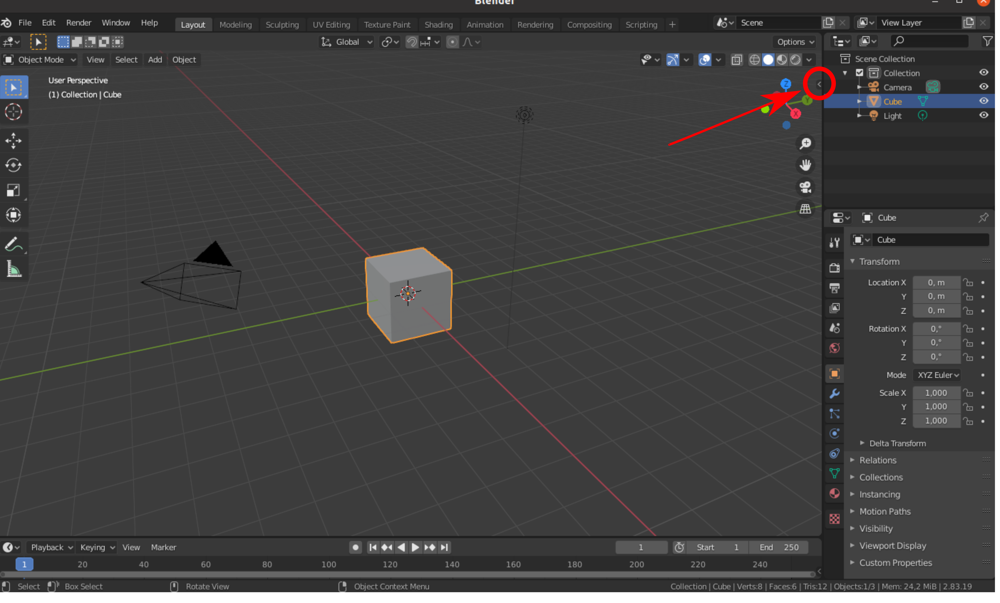

.. _manual_install:

Installation
============

Installation with Installer Script
^^^^^^^^^^^^^^^^^^^^^^^^^^^^^^^^^^

We currently support Blender version 2.8.

To install the plugin on Linux and Windows follow these steps:

1.  Download a supported Blender version from the dedicated website. Windows users download and install the  `*.msi` installer. `Go to Blender download page <https://download.blender.org/release/>`__

2.  Download the Robot Designer installation file “robotdesigner_installer.blend” from our GitHub repository . `Download installation file <https://github.com/hbpneurorobotics/BlenderRobotDesigner/raw/master/robotdesigner_installer.blend>`__

3.  Launch Blender and open the downloaded "robotdesigner_installer.blend" file, then click on the triangle above the script to execute it. The installation may take a bit of time while Blender is remaining passive. Once the installation is done you will see the Robot Designer plugin opening on the right side along with the "Tool", "View" and "Edit" tabs, as shown in the image below.

.. figure:: ../RobotDesignerInstall_plugin.png
	:align: center

	After running the Robot Designer installation script (on the left) you will find the plugin opening up on the right side of the 3D view.

	If the plugin does not pop up, you will find it by opening the pane on the right of the 3D view with clicking on the small arrow.

Troubleshooting
^^^^^^^^^^^^^^^

- `Start Blender from terminal <https://docs.blender.org/manual/en/2.79/advanced/command_line/introduction.html>`__  to see log output during the installation process and runtime.
- In newer versions you can open the terminal view via ``Window->Toggle System Console``.
- If the plugin does not show up or does not show up anymore after restarting Blender make sure it is enabled: Navigate to ``Edit->Preferences->Add-Ons`` tab. Search for the NRP Robot Designer add-on and check the box to enable the plugin. You may need to restart Blender thereafter.
- If you see the error ``No module named 'pyxb'`` in the terminal try the following:

   In your terminal go to ``[blender-version]/[version]/python/bin`` and run ``./python3.7m -m pip install pyxb==1.2.5``

- Additional logs during runtime of the plugin are written to ``blender_module_path/robot_designer_plugin/resources/log.txt``

   - Ubuntu: ``blender_module_path =  $HOME/.config/blender/[version]/scripts/addons/``
   - Windows: ``blender_module_path =   C:\Users\[profile]\AppData\Roaming\Blender Foundation\blender\[version]\scripts\addons``

Manual Installation
^^^^^^^^^^^^^^^^^^^

Get a copy
----------

The NRP RobotDesigner is open source and hosted on
`GitHUB <https://github.com/HBPNeurorobotics/BlenderRobotDesigner>`_.  The source code of the newest version can be downloaded
as a zipped file from `here <https://github.com/HBPNeurorobotics/BlenderRobotDesigner/archive/master.zip>`_, or
via the GIT version control system is installed, like this:

.. code-block:: console

   user@hbp ~/projects $ git clone https://github.com/HBPNeurorobotics/BlenderRobotDesigner.git
   user@hbp ~/projects$ cd BlenderRobotDesigner/

Link Robot Designer plugin code
-------------------------------

All Blender add-ons need to be installed in its dedicated add-on path in order to be
found. For a manual installation we link the source code to a corresponding add-on
folder in the Blender configuration path, this path differs depending on your
host operating system.
Replace ``<installed_blender_version>`` in below's instructions by the Blender version you got installed (e.g., ``2.83``)

Linux
"""""

.. code-block:: console

   user@hbp ~/projects/BlenderRobotDesigner$ mkdir -p ~/.config/blender/<installed_blender_version>/scripts/addons/
   user@hbp ~/projects/BlenderRobotDesigner$ ln -s $PWD/robot_designer_plugin ~/.config/blender/<installed_blender_version>/scripts/addons/

Mac Os X
""""""""

.. code-block:: console

   user@hbp ~/projects/BlenderRobotDesigner$ mkdir -p ~/Library/Application\ Support/Blender/<installed_blender_version>/scripts/addons/
   user@hbp ~/projects/BlenderRobotDesigner$ ln -s $PWD/robot_designer_pluting ~/Library/Application\ Support/Blender/<installed_blender_version>/scripts/addons/

Windows
"""""""

.. code-block:: console

   C:\Documents and Settings\$USERNAME\AppData\Roaming\Blender Foundation\Blender\<installed_blender_version>\scripts\addons

Install Python Dependencies
---------------------------
The Robot Designer plugin requires pyxb 1.2.5

Enable Plugin
-------------
Navigate to ``Edit->Preferences->Add-Ons`` tab. Search for the NRP Robot Designer
add-on and check the box to enable the plugin. You may need to restart Blender thereafter.
